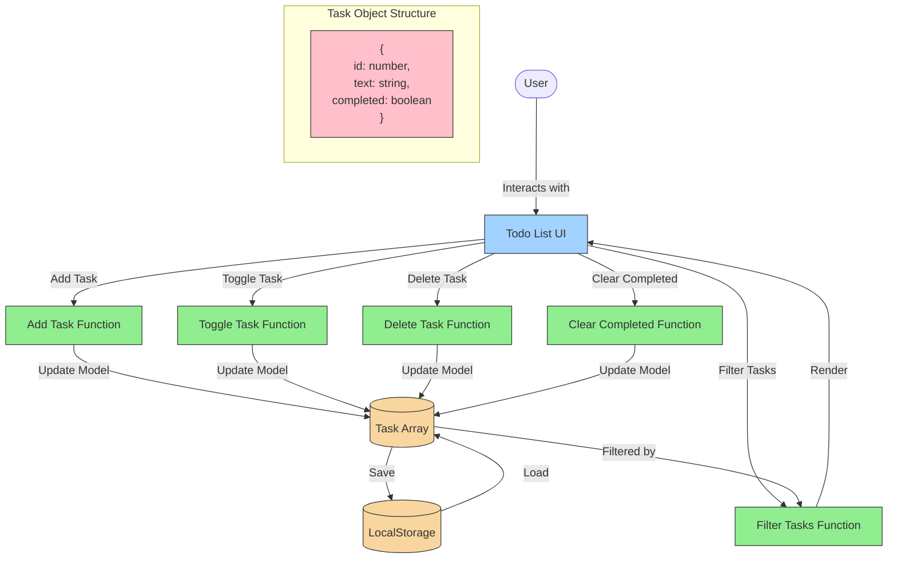

# Todo List App Architecture

This document outlines the architecture and data flow of our Todo List application.

## Application Structure

The application follows a simple MVC-like pattern:
- HTML (View): Defines the UI structure
- CSS (View): Styles the UI components
- JavaScript (Controller): Handles user interactions and updates the model
- LocalStorage (Model): Stores task data persistently

## Data Flow Diagram

The following Mermaid.js diagram illustrates the data flow in our Todo List application:

## Component Interactions

1. **User Input**: User interacts with the UI by adding, completing, or deleting tasks
2. **Event Handling**: JavaScript event listeners capture these interactions
3. **Data Manipulation**: Functions process the interactions and update the task array
4. **Persistence**: Changes are saved to localStorage
5. **Rendering**: The UI is updated to reflect the current state of tasks

## Filter Functionality

The application supports three view filters:
- **All**: Shows all tasks
- **Active**: Shows only uncompleted tasks
- **Completed**: Shows only completed tasks

Filtering is performed in-memory and does not affect the stored tasks.
